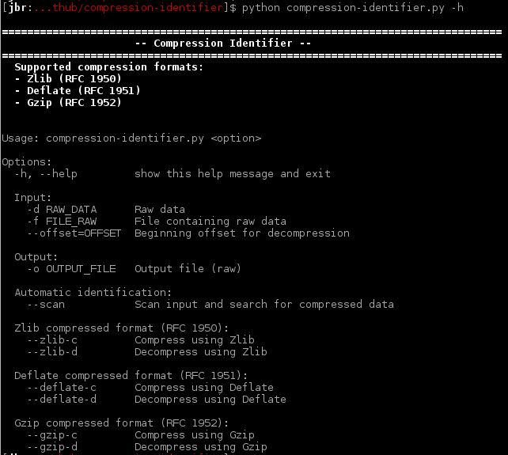
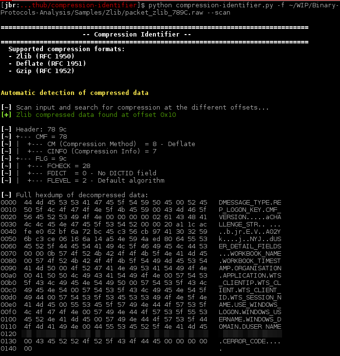
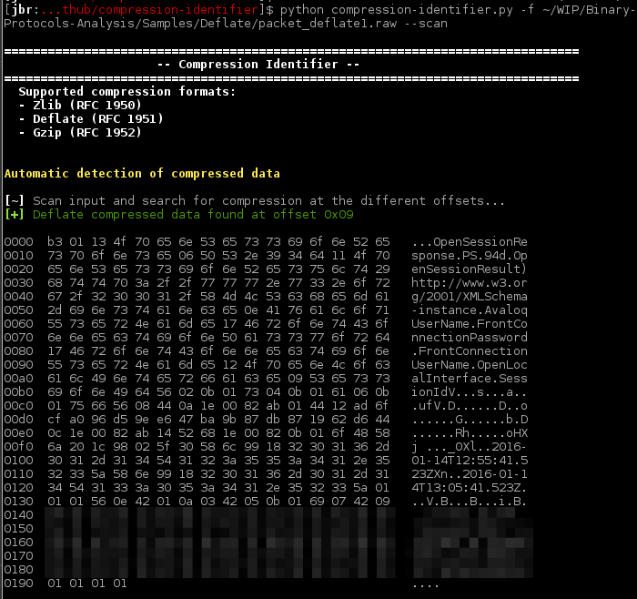

compression-identifier
====

Small tool that permits to detect compressed data into raw data (packet with binary data for example). It can also be used to compress data into a given format. Originally, it has been developped to deal with compressed data when performing network traffic analysis during security audits of thick clients.

Supported compression algorithms
* **Zlib**: [RFC 1950](./references/rfc1950.txt)
* **Deflate**: [RFC 1951](./references/rfc1951.txt)
* **Gzip**: [RFC 1952](./references/rfc1952.txt)

